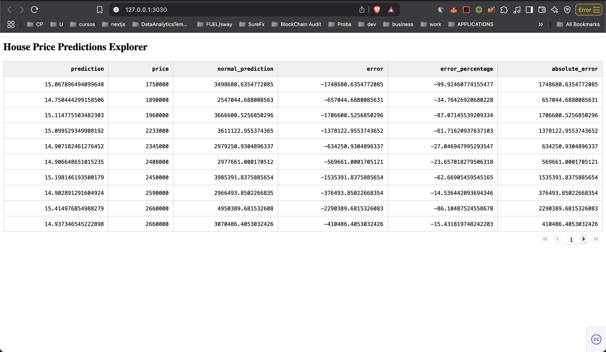
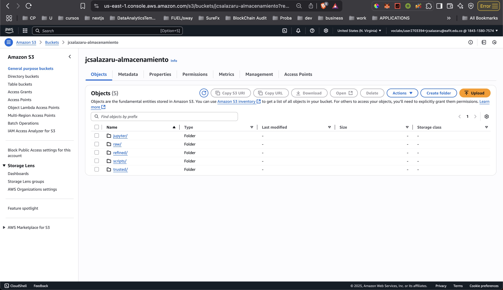
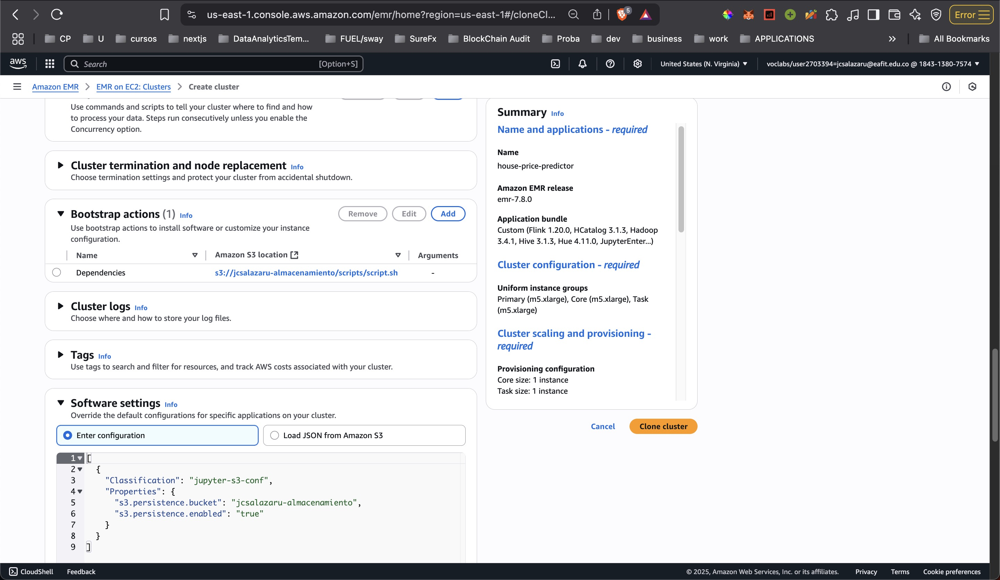
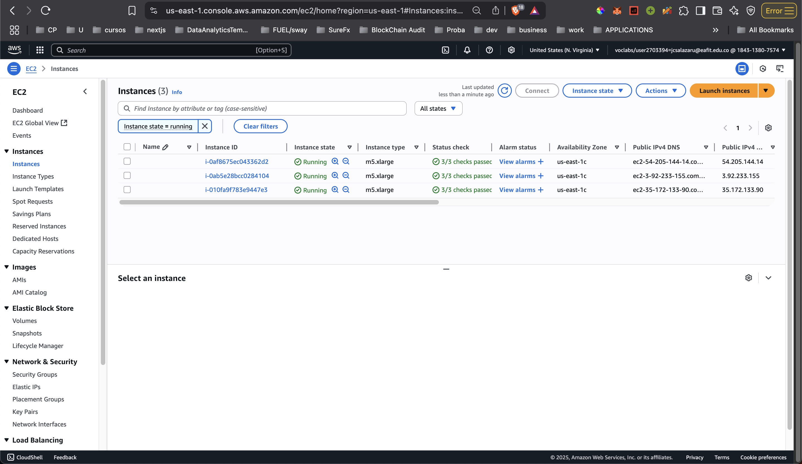
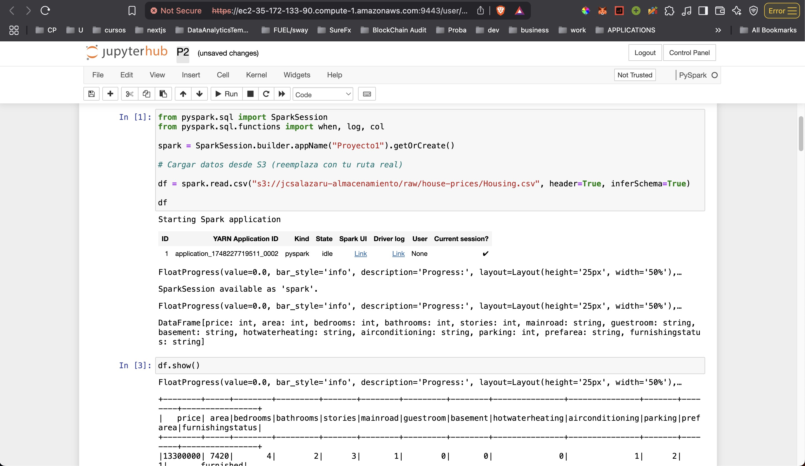
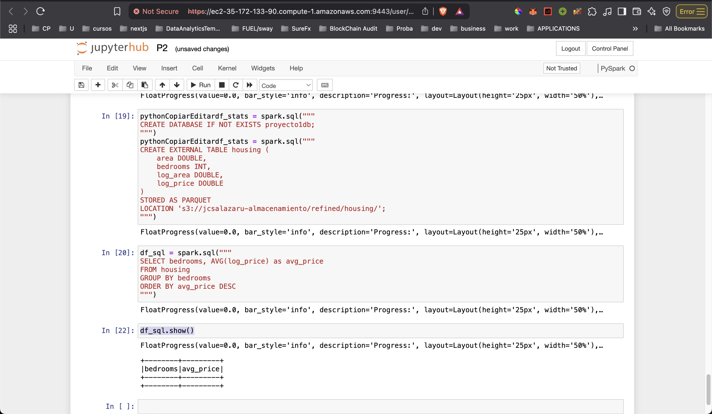

# House Price Prediction Project Documentation

## Project Overview
This project implements a machine learning solution for predicting house prices based on various features. The implementation includes comprehensive data preprocessing, multiple model comparisons, MLflow for experiment tracking, and a scalable data pipeline using AWS EMR and S3 for data storage and processing.

## Architecture Overview

### Data Pipeline
1. **Data Ingestion**
   - Raw data ingestion into S3 raw zone
   - Data validation and cleaning in EMR cluster
   - Processed data stored in trusted/refined zones

2. **Processing Layer**
   - EMR cluster with Spark for distributed processing
   - PySpark for data transformations and model training
   - Data partitioning for efficient processing

3. **Frontend Visualization**
   - Dash web application for interactive data exploration
   - DuckDB for efficient query performance
   - Lazy loading implementation for large datasets

## Data Processing and Feature Engineering

### Features Used
- **Numerical Features**: 
  - area
  - bathrooms
  - stories
  - parking
  - bedrooms

- **Binary Features**:
  - airconditioning (yes/no)
  - prefarea (yes/no)

- **Nominal Features**:
  - furnishingstatus (furnished/semi-furnished/unfurnished)

### Preprocessing Pipeline
1. **Data Cleaning**:
   - Missing value imputation
     - Median strategy for numerical features
     - Most frequent strategy for categorical features
   - Feature scaling using StandardScaler
   - One-hot encoding for nominal features

2. **Data Split**:
   - Training set: 80%
   - Test set: 20%
   - Random state: 42 for reproducibility

## Model Implementation

### Models Evaluated
1. **Linear Regression**
   - Baseline model for comparison
   - Simple interpretable results

2. **Random Forest Regressor**
   - Ensemble learning approach
   - Better handling of non-linear relationships

3. **XGBoost Regressor**
   - Advanced gradient boosting
   - Hyperparameters:
     - n_estimators: 100
     - random_state: 42

### Evaluation Metrics
- R² Score (Coefficient of Determination)
- Root Mean Squared Error (RMSE)
- Mean Absolute Error (MAE)
- Mean Absolute Percentage Error (MAPE)
- Maximum Error

## Data Analysis Results

### Price Distribution
- **Range**: 1,750,000 to 13,300,000
- **Skewness**: 1.21 (right-skewed distribution)
- **Distribution Visualization**: Histogram analysis shows price concentration in lower ranges

### Feature Importance
- XGBoost feature importance analysis reveals key price determinants
- Visualization using seaborn barplots
- Helps identify most influential features in price prediction

## AWS Implementation

### S3 Data Lake Architecture
- **Raw Zone**: Initial data ingestion
  - Original CSV/Parquet files
  - Unprocessed data storage
  
- **Trusted Zone**: Validated data
  - Data quality checks
  - Cleaned datasets
  
- **Refined Zone**: Analytics-ready data
  - Processed features
  - Model predictions
  - Aggregated results

### EMR Cluster Configuration
- **Master Node**: Cluster management and coordination
- **Worker Nodes**: Distributed processing
- **Bootstrap Scripts**: Cluster initialization and setup (installing numpy)
- **Jupyter Integration**: Interactive development environment

### DuckDB Integration
- **Lazy Loading Implementation**:
  - Efficient querying of S3 data
  - Minimal memory footprint
  - Dynamic data loading based on user interaction
  
- **Dash Frontend Integration**:
  - Data visualization
  - Paginated data display
  - Interactive filtering and sorting
  - Direct S3 bucket querying refined zone
  


## Evidence of AWS Implementation

1. **S3 Bucket Configuration and Data Zones**
   - Raw, Trusted, and Refined zones setup
   - Bootstrap scripts for cluster configuration


2. **EMR Cluster Setup**
   - Cluster configuration and security settings
   - Network and instance specifications


3. **EC2 Instances for EMR**
   - Master and worker nodes
   - Distributed processing capability


4. **PySpark Development Environment**
   - Jupyter notebook integration
   - Interactive data processing


5. **Data Pipeline Execution**
   - S3 data writing operations
   - Pipeline monitoring and debugging


6. **Athena integration (Data Warehouse)**
    - Set up automatic data cataloging with **AWS Glue** to understand data structure
    - Ready for future SQL queries and reporting

## Project Structure
```
house-price-predictor/
├── data/
│   ├── raw/          # Initial data files
│   └── staged/       # Processed datasets
├── src/
│   └── house_price_predictor/
│       ├── model/    # ML model implementations
│       │   ├── estimators.py
│       │   └── evaluator.py
│       └── dash_app/ # Frontend visualization
├── mlruns/          # MLflow experiment tracking
└── notebooks/       # Development notebooks
```

## Conclusion
The project successfully implements a comprehensive house price prediction system with:
- Robust data preprocessing and feature engineering
- Multiple model implementations and comparisons
- Scalable AWS infrastructure using EMR and S3
- Efficient data access using DuckDB
- Interactive visualization through Dash
- Integration with modern MLOps practices

The system is designed for both accuracy and scalability, with potential for future enhancements and real-world deployment. The combination of AWS services, DuckDB, and Dash creates a powerful and efficient data pipeline for real-time house price predictions.
