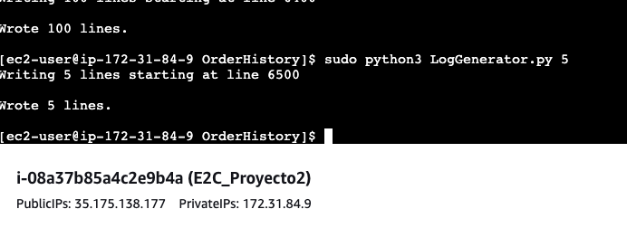
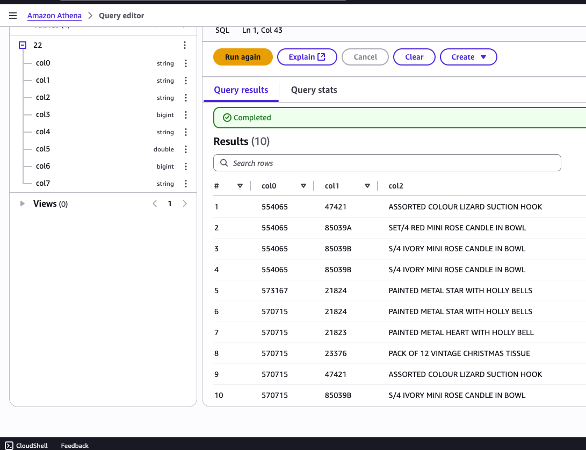
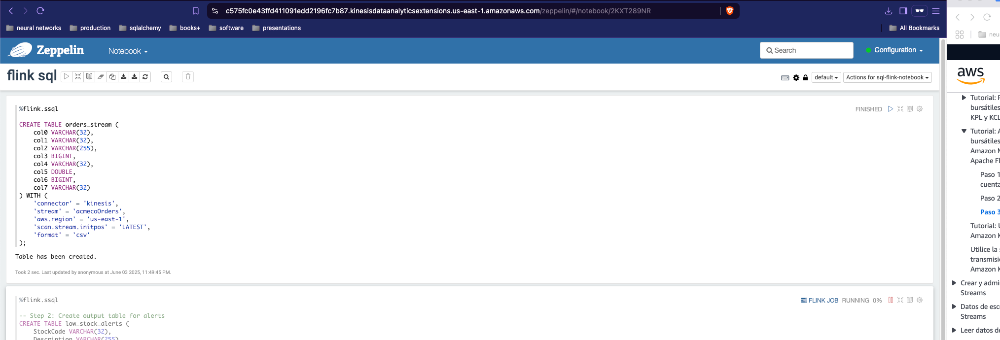
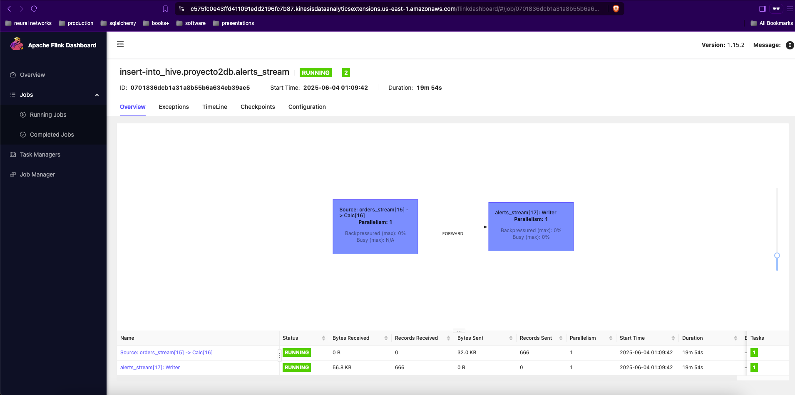
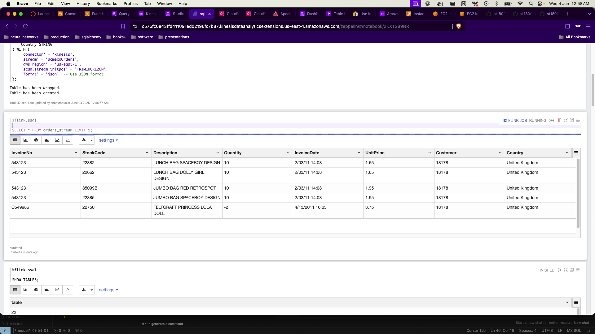
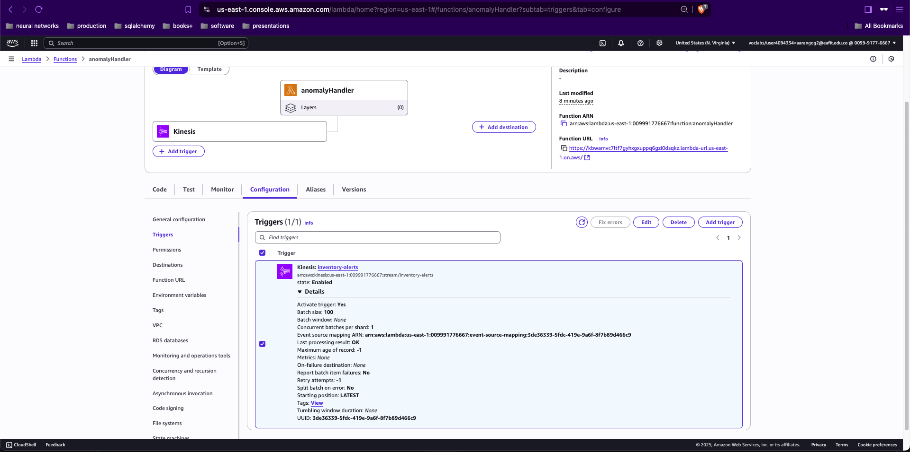
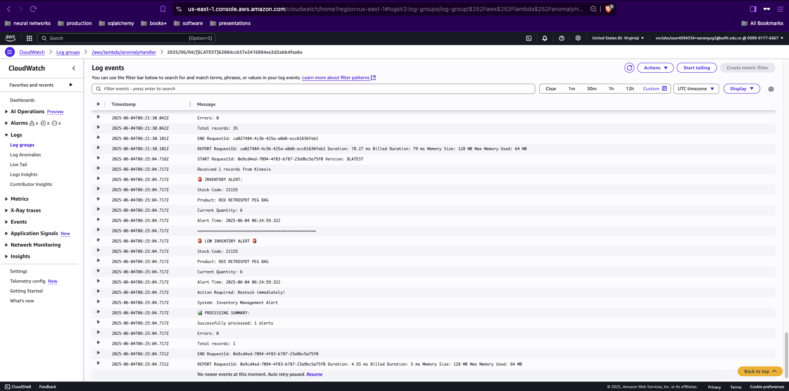
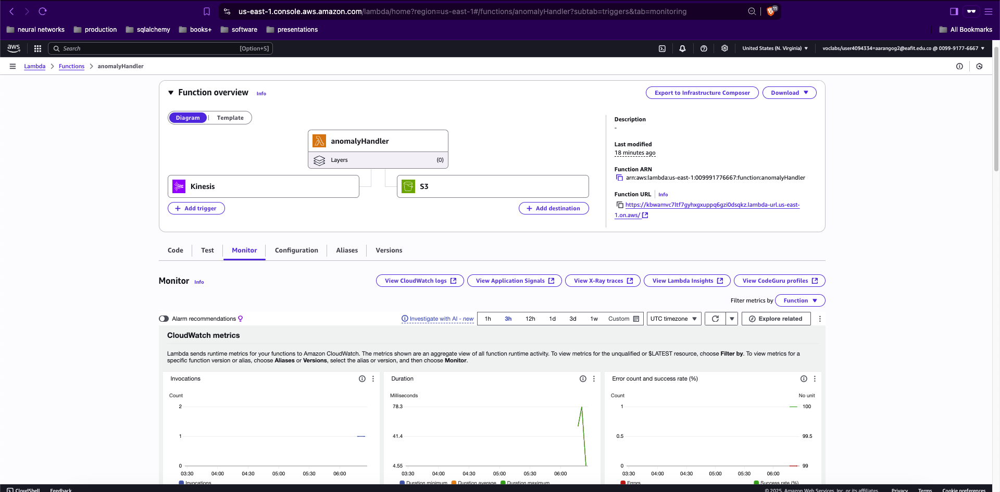

# Sistema de Detección de Anomalías de Inventario en Tiempo Real

## Descripción General del Proyecto
Este proyecto implementa un sistema de detección de anomalías en tiempo real para la gestión de inventario minorista utilizando servicios de AWS. El sistema procesa datos de transacciones minoristas, identifica anomalías en el inventario y genera alertas para artículos con patrones de cantidad inusuales.

## Arquitectura
El sistema consta de los siguientes componentes:
1. Generación de Datos (LogGenerator.py)
2. Ingesta de Datos (AWS Kinesis Agent)
3. Procesamiento de Flujo (Amazon Kinesis Data Analytics con Flink SQL)
4. Procesamiento de Alertas (AWS Lambda)


*Figura 1: Instancia EC2 ejecutando el script LogGenerator.py*

## Pasos de Implementación

### 1. Generación de Datos y Verificación Inicial
- Se creó un script LogGenerator.py que lee desde OnlineRetail.csv
- Genera registros de transacciones en formato JSON
- Escribe los logs en `/var/log/acmeco/`
- Los campos de datos incluyen: InvoiceNo, StockCode, Description, Quantity, InvoiceDate, UnitPrice, Customer, Country


*Figura 2: Verificación de ingesta de datos usando consultas de Amazon Athena*

### 2. Configuración de Ingesta de Datos
- Se configuró Kinesis Agent con dos flujos de datos:
  1. Flujo hacia Kinesis Firehose para archivo de datos
  2. Flujo hacia Kinesis Data Stream con transformación CSVTOJSON
- Se verificó el flujo de datos usando Kinesis get-records mostrando el formato JSON exitoso


*Figura 3: Notebook de Zeppelin mostrando el flujo de datos de órdenes*

### 3. Procesamiento con Flink SQL
La implementación de Flink SQL consta de tres componentes principales:


*Figura 4: Panel de Control de Apache Flink mostrando métricas de trabajos activos*

1. Definición de Tabla Fuente:
```sql
CREATE TABLE orders_stream (
    InvoiceNo VARCHAR(32),
    StockCode VARCHAR(32),
    Description VARCHAR(255),
    Quantity INT,
    InvoiceDate TIMESTAMP,
    UnitPrice DECIMAL(10,2),
    CustomerID VARCHAR(32),
    Country VARCHAR(32),
    WATERMARK FOR InvoiceDate AS InvoiceDate - INTERVAL '5' SECONDS
) WITH (
    'connector' = 'kinesis',
    'stream' = 'acmecoOrders',
    'aws.region' = 'us-east-1',
    'scan.stream.initpos' = 'LATEST',
    'format' = 'csv'
);
```


*Figura 5: Configuración inicial de lectura de stream en Flink SQL*

2. Definición de Stream de Alertas:
```sql
CREATE TABLE low_stock_alerts (
    StockCode VARCHAR(32),
    Description VARCHAR(255),
    CurrentQuantity INT,
    AverageQuantity DOUBLE,
    AlertTime TIMESTAMP
) WITH (
    'connector' = 'aws-lambda',
    'function.name' = 'inventory-alert-function',
    'aws.region' = 'us-east-1'
);
```

3. Lógica de Detección de Anomalías:
```sql
INSERT INTO low_stock_alerts
SELECT 
    StockCode,
    Description,
    Quantity as CurrentQuantity,
    AVG(Quantity) OVER (
        PARTITION BY StockCode 
        ORDER BY InvoiceDate 
        RANGE BETWEEN INTERVAL '1' HOUR PRECEDING AND CURRENT ROW
    ) as AverageQuantity,
    CURRENT_TIMESTAMP as AlertTime
FROM orders_stream
WHERE Quantity < 10;
```

### 4. Procesamiento de Alertas
- Se creó la función Lambda `anomalyHandler` para procesar alertas
- Se configuró el trigger de Kinesis para la función Lambda
- La función procesa registros JSON y registra detalles de anomalías


*Figura 6: Configuración de función Lambda con trigger de Kinesis*


*Figura 7: Logs de CloudWatch mostrando alertas de anomalías procesadas*


*Figura 8: Configuración adicional de Lambda para procesamiento de eventos S3*

## Proceso de Pruebas y Verificación
1. Pruebas de Generación de Datos
   - Verificación de generación de logs en EC2 (Figura 1)
   - Confirmación de estructura de datos usando consultas Athena (Figura 2)

2. Verificación de Procesamiento de Stream
   - Monitoreo de flujo de datos a través de notebook Zeppelin (Figura 3)
   - Seguimiento de métricas de procesamiento vía Panel de Flink (Figura 4)
   - Validación de configuración de lectura de stream (Figura 5)

3. Pruebas del Sistema de Alertas
   - Confirmación de configuración del trigger Kinesis (Figura 6)
   - Monitoreo de procesamiento de alertas en CloudWatch (Figura 7)
   - Verificación de manejo de eventos S3 (Figura 8)

## Resultados
- Procesamiento exitoso de datos de transacciones minoristas en tiempo real
- Detección de anomalías de inventario basada en umbrales de cantidad
- Generación de alertas para artículos que requieren atención
- Establecimiento de pipeline de datos end-to-end para monitoreo de inventario

## Desafíos y Soluciones
1. Sincronización de Formato de Datos
   - Desafío: Incompatibilidad inicial entre formatos CSV y JSON
   - Solución: Implementación de transformación CSVTOJSON en Kinesis Agent
   - Evidencia: Transformación exitosa verificada a través de consultas Athena (Figura 2)

2. Configuración de Flink SQL
   - Desafío: Resultados de consultas no se mostraban inicialmente
   - Solución: Ajuste de posición de stream y configuración de paralelismo
   - Evidencia: Métricas funcionales en el panel de Flink (Figura 4)

3. Integración de Lambda
   - Desafío: Configuración de trigger y permisos
   - Solución: Configuración de roles IAM y habilitación de trigger para procesamiento en tiempo real
   - Evidencia: Configuración exitosa del trigger Lambda (Figura 6) y logs de CloudWatch (Figura 7)

## Mejoras Futuras
1. Agregar algoritmos más sofisticados de detección de anomalías
2. Implementar dashboards en tiempo real para monitoreo
3. Agregar sistema de notificación de alertas (ej. integración con SNS)
4. Mejorar el preprocesamiento y validación de datos

## Conclusión
El sistema implementado demuestra exitosamente la detección de anomalías en tiempo real para la gestión de inventario. A través de pruebas y verificación exhaustivas, como se evidencia en las capturas de pantalla incluidas, hemos establecido un pipeline robusto para monitorear transacciones minoristas e identificar posibles problemas de inventario en tiempo real. La funcionalidad del sistema ha sido verificada en cada etapa del flujo de datos, desde la generación inicial hasta el procesamiento y manejo de alertas.
